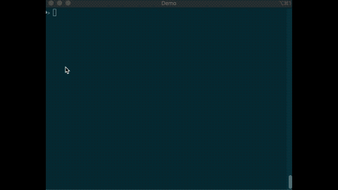

# kubectl fzf plugin

This is still under development and some BREAKING CHANGES may happen until stable release.



## tl;dr
This plugin is the similar to the next command (fish).

```fish
$ set -l resource pods resource
$ kubectl get $resource | fzf --layout=reverse --preview="kubectl describe $resource {1}" --header-lines 1 --preview-window=down:80% --bind $key_bindings | awk '{ print $1 }' | string trim
```

## Install
```shell script
$ go get -u github.com/at-ishikawa/kubectl-fzf/cmd/kubectl-fzf
```

## How to use
```
$ kubectl fzf get pods
```

## Requirements
* go (version 1.13)
* fzf
* kubectl


# TODOs
* Read FZF environment variables
* Define and use custom environment variables
    * key bindings
    * preview command
* Pass custom arguments
* Error handlings
* Help messages
* Update README.md
* Write CI
* krew support?
